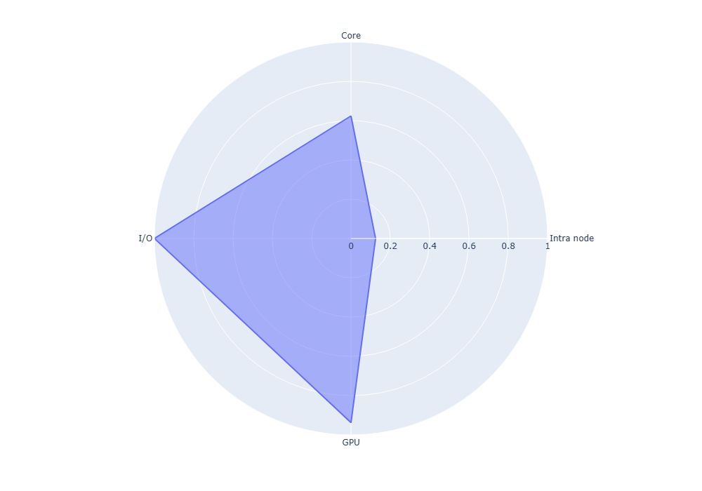

#  SHAREing: High-level performance assessment report

## Setup Details
* Program: `stencil-2d`
* Parallel model: `OpenMP`
* Dependencies: 
* Compiler: `g++`
* Compiler flags: `-O3 -march=native -fopenmp`
* Problem spec: 

## CPU Analysis
For a basic high-level analysis of CPU performance, we look for the floating-point operation rate compared to the theoretical rate for the hardware.

The hardware capabilities were determined with
```shell
$ likwid-bench -t peakflops -W S0:64kB:1
```

The code was benchmarked with
```shell
$ likwid-perfctr -f -C 0 -g FLOPS_DP ./cuda-stream
```

These yielded a hardware peak performance of `8800.5` MFLOP/s and an actual performance of `5492.5` MFLOP/s. We hence determine this code to have a CPU score of `0.6242`.

## GPU Analysis
For a basic high-level analysis of GPU performance, we look for the average occupancy of the GPU floating-point modules.

This section is not applicable to OpenMP, but we compiled a CUDA version and measured that.

The occupancy was determined with
```shell
$ ncu --csv --metrics sm__warps_active.avg.pct_of_peak_sustained_active --print-fp --log-file stencil-2d-cuda.metrics.csv ./stencil-2d-cuda
```

Over the 10 iterations run by default, the average occupancy was `93.78%`.

## IO Analysis
For a basic high-level analysis of IO performance, we look for the proportion of the runtime spent processing IO requests.

As this is a purely synthetic test code, the IO time is 0. For the purposes of this example, we have created a program that will read in a bunch of random data, increase each byte by a bit, and write it out again. The execution is overall timed by wrapping in `clock_gettime(CLOCK_MONOTONIC, &time)` and taking the difference between start and end.

We used `darshan` to profile IO time. In order for this to work we need to set up darshan to profile programs which aren't running using MPI:
```shell
$ export DARSHAN_ENABLE_NONMPI=1
```

We can now profile our `sample_io` program with
```shell
$ env DARSHAN_LOGFILE=sample_read.darshan LD_PRELOAD=libdarshan.so ./sample_io
Elapsed: 2.257649s (2257649.4460 µs), for size 1073741812
```

The easiest way to get the results out is
```shell
$ darshan-parser --total sample_read.darshan | grep "F_.\{4,5\}_TIME:"
total_STDIO_F_META_TIME: 0.254716
total_STDIO_F_WRITE_TIME: 0.495494
total_STDIO_F_READ_TIME: 1.122406
```

We can now calculate our IO utilisation ratio as `(1.122+0.495+0.255)/2.258=0.829`, and the IO score as `1-0.829=0.171`.

In reality, `stencil-2d` doesn't do any file IO so gets an IO score of `1.000`.

## Intra-node Analysis
For a basic high-level analysis of intra-node performance, we perform a strong scaling by fixing the problem size and increasing core allocation.

For this code, we tested with core counts in powers of 2 from 1 to 64.

| Thread count | Time (s) | Parallel Efficiency |
| - | - | - |
| 1 | 29.995 | 1.000 |
| 2 | 18.230 | 0.823 |
| 4 | 10.740 | 0.698 |
| 8 | 10.330 | 0.363 |
| 16 | 9.1307 | 0.205 |
| 32 | 8.5401 | 0.110 |
| 64 | 7.4589 | 0.063 |

Hence, our 80% threshold is at >=4 cores and our 60% threshold is at >=8. As a proportion of the number of cores available, which is 128 on the node this was run on, this is 0.03 and 0.06.

## Inter-node Analysis
For a basic high-level analysis of inter-node performance, we perform a weak scaling by increasing problem size linearly with node allocation.

As this code does not utilise MPI or other inter-node features, this section is not applicable.

## Summary

The following table collates the results of all above sections. These scores are indicative only, and cannot truly be compared to one another meaningfully without taking into account domain knowledge and methodological differences between them.

| Result | Score | 
| ----------- | ----------- |
| CPU | 0.624 |
| GPU | 0.938 |
| IO | 1.000 |
| Intra-node (80%) | 0.03125 |

With that said, from this table and with our knowledge of performance engineering, we would recommend that the CPU variant of the algorithm or the intra-node scaling be examined as potential points where improvements could be made.

# 